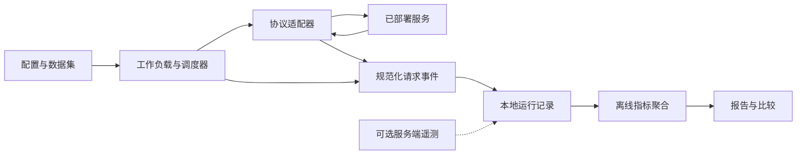

# serving-bench：首版设计讨论稿

状态：提案，2026-09-18。本文中的命令、模块和配置均未实现。

## 1. 定位

给一个已部署模型的服务地址，在声明的输入、输出和负载条件下，测出用户实际感受到的性能，并保留能重新统计、审查和比较的证据。

第一版把“性能”定义为服务速度、承载能力和稳定性。模型答题质量属于独立评测维度；不能用 tokens/s 推导模型能力，也不能仅凭速度推荐不同模型或量化版本。

工具独立于引擎进程，可在笔记本、独立压测机或服务同机前台执行。不安装 Torch/CUDA，不自动部署、重启、清缓存或修改服务。

与组织内项目的关系：Forge 负责搜索和验证部署方案，未来可消费本工具的版本化结果；LDB 负责运行时调试；本项目负责在线服务测量。首版不改动另外两个仓库。

## 2. 为什么单独做

vLLM 与 SGLang 已有官方 serving benchmark。我们复用这些项目的术语和对照验证，而把新增价值放在跨引擎一致的事件记录、私有协议适配、测量口径和离线报告上。

第一版建议自有一个小型 HTTP 负载执行器，以保证不同目标用同一个时钟和聚合实现。官方 benchmark 用于同场景趋势交叉检查，不直接拼接不同版本的摘要得出排名。未来如导入原生结果，必须保留其原生口径和来源。

参考资料（设计时查阅；实现时另行固定版本）：

- [vLLM bench serve](https://docs.vllm.ai/en/stable/cli/bench/serve/)
- [vLLM benchmarking notes](https://github.com/vllm-project/vllm/blob/main/docs/benchmarking/cli.md)
- [SGLang serving benchmark guide](https://docs.sglang.ai/developer_guide/bench_serving)

## 3. 用户工作流

1. 写配置：endpoint、模型名、鉴权环境变量、数据集、负载和预算。
2. `validate`：仅检查配置、数据文件和参数范围，不访问服务。
3. `probe`：明确发送少量请求，记录流式、usage、结束标记等能力；无法确认的能力标为 unknown。
4. `run`：预热、测量、排空；每轮使用新目录，失败也保留证据。
5. `report`：只读本地产物，重新聚合，输出 JSON、CSV、Markdown。
6. `compare`：先检查可比性，再显示差异；条件不一致则解释原因，不自动产生胜负。

SDK 与 CLI 使用同一套实现。示例命令见 README，当前均不可执行。

## 4. 架构



| 模块 | 职责 | 边界 |
| --- | --- | --- |
| workload | 固定种子、数据集身份、请求顺序、长度分布 | 不把字符数冒充 token 数 |
| runner | 到达计划、并发、预算、取消和连接池 | 不隐藏重试，不积累无界队列 |
| adapters | 构造协议请求、解析流、归一化事件和错误 | 不自行计算汇总指标 |
| metrics | 从事件计算延迟、吞吐、SLO 和分位数 | 不依赖引擎名称修改公式 |
| artifacts/report | 写证据、离线重算、比较 | 不再次访问服务 |

拟用 Python 3.11+、asyncio、httpx；参数配置先用标准 JSON 和 dataclass，CLI 用 argparse。需要本地 token 估计时才安装 tokenizer 可选依赖。首版适配器用明确注册表，不先做插件市场或动态脚本配置。

## 5. 协议和私有引擎

首版实现 `/v1/chat/completions`、`/v1/completions` 的 streaming / non-streaming。vLLM、SGLang 和兼容私有引擎共享适配器，实际支持情况通过能力检查和真实端点验收记录。

非兼容私有 HTTP 协议通过 Python adapter 接入：`capabilities()` 声明已知能力，`build_request()` 构造请求，`parse_response()` 输出统一事件。调度、计时、错误分类和聚合仍由核心负责。gRPC、WebSocket 和引擎内部 profiler 留到具体需求出现。

最小事件包含 request_id、单调时钟相对时间、事件类型、通道、可选 token 数及计数来源。类型覆盖 scheduled、dispatched、headers、content_delta、usage、completed、failed；content_delta 区分 answer、reasoning、tool，角色帧、心跳、空帧均不算内容。

鉴权值仅从环境变量读取；日志和 manifest 不存 header 秘钥或带凭据 URL。TLS 默认校验证书，私有 CA 可配置。原始 prompt/response 默认不落盘，完整内容需显式开启；默认保存数据集哈希、样本 ID 和时间/计数证据。精确请求重放需要原数据集仍可取得，单独结果包只保证指标重算。

## 6. 指标口径是核心接口

每个请求记录计划到达 `t_scheduled`、开始执行 HTTP 请求 `t_dispatch`、首个有效生成内容 `t_first`、首个 answer 内容 `t_answer`、最后内容 `t_last`、完成/失败 `t_terminal`。`t_dispatch` 在调用 HTTP transport 前记录，包含连接池等待、网络和服务端耗时，不声称是网卡实际发包时刻。全部区间用同一客户端单调时钟计算。

| 指标 | 定义与限制 |
| --- | --- |
| 调度延迟 | `t_dispatch - t_scheduled`，暴露压测机跟不上计划的问题 |
| 客户端 TTFT | `t_first - t_dispatch`；严格说是首个有效生成内容可见时间，reasoning/tool 可触发；另报首 answer 延迟 |
| E2E | `t_terminal - t_dispatch`，另报包含调度等待的用户等待时间 |
| 平均每输出 token 时间 | `(t_last - t_first)/(N-1)`，只对成功流式请求且 N>1、通道和计数一致时有效；标为客户端估计，使用最后内容时间以避免 usage 尾帧延迟 |
| 流块间隔 | 相邻非空内容 chunk 的时间差；普通 SSE 只能直接测此值，绝不标成精确 ITL |
| 精确 ITL | 仅在有逐 token 时间信息时提供，并注明客户端或服务端来源；缺失则 N/A |
| 请求吞吐 | 测量 cohort 中成功请求数 / cohort 总墙钟窗口 |
| 输出吞吐 | 成功请求的输出 token 总数 / 同一窗口；input/output/total 分开，不称为纯 decode 速度 |
| Goodput | 同时满足全部配置 SLO 的成功请求数 / 同一窗口；明确单位 requests/s |
| 稳定性 | 成功率、HTTP 错误、限流、超时、解析失败、中途断流、客户端拒绝/取消各自计数 |

主窗口从首个测量请求计划到达开始，到测量停止时刻与最后一个 cohort 请求终态二者的较晚者结束，包含排空时间。预热和冷却不计入；请求数模式的停止时刻为最后一个计划到达时刻。拒绝、超时和失败不从 cohort 消失。另列计划到达率、实际发送率、成功率和排空耗时；不把排空后的完成量除以更短的发压时间。

延迟分别输出成功请求分布、失败请求终态耗时和 SLO 达标比例；不能用“只统计成功请求”藏起过载。分位数算法固定为 nearest-rank，列明有效样本数；小样本 P99 标记样本不足。没有首内容或 token 数时相关值为 null 并给原因，不能填 0。

usage 来源分为 server_reported、local_tokenizer_estimate、unknown；服务端报数也不是独立验证。记录 tokenizer revision、chat template、计数通道、reasoning 是否包含，以及 usage 各字段是否重叠。不能把已包含的 reasoning token 再加一次；只见答案却收到包含隐藏 reasoning 的总数时，不计算上述每 token 时间。无法确认一致则相关 token 指标 N/A。缺失 usage 的请求不得静默从总吞吐分母或分子消失：正式 token 吞吐置空，可另给明确标注覆盖率的部分观测值。

非流式只报告 E2E、整体吞吐和错误；不推导 TTFT/ITL。客户端不能拆出真实服务端排队、prefill、decode 耗时；这些必须依赖可选遥测且单独展示。

## 7. 工作负载与公平比较

首版提供两种负载，分别运行，不混合解释：

- Closed-loop：固定在途请求数，完成后补位，用于并发扫描。
- Open-loop：固定种子的 Poisson 或固定间隔到达，用于指定 RPS。达到 max_in_flight 时记 client_rejected，不延迟到未来偷偷变成闭环；同时记录调度迟到。客户端跟不上时标记 run 为受限，不宣称服务容量。

每次运行必须有请求数或时长上限、请求超时、并发上限及有限排空期限。默认零自动重试；未来如支持重试，每次 attempt 独立记录并报告逻辑请求结果。预算耗尽取消未完成请求，标记 run 是否 incomplete。

建议预设：交互短问答、长输入短输出、短输入长输出、混合长度。并发扫描例如 1/2/4/8/16/32；输入长度与输出上限由用户显式设置。`max_tokens` 是上限，不保证实际生成量；强制长度/ignore_eos 只在已声明支持时启用，并作为独立实验条件。

使用本地 JSONL 语料，固定数据文件 SHA-256、样本次序和种子。精确输入 token 长度要求匹配 tokenizer 与 chat template；不知道服务端模板时只能标称或估计。不同 tokenizer 的模型优先按同一语义数据集比较，并明确 token 单位不可直接等价。

预热与测量使用不同样本；重复请求可能命中 prefix cache，因此每次记录缓存策略为 cache_disabled、unique_prefix、intentional_reuse 或 unknown。unique_prefix 只是降低复用，不证明冷缓存；客户端不自动清理服务端缓存。预热、测量、重复轮次的 workload 哈希均保留。

正式对比建议至少三轮，轮换 baseline/candidate 顺序，报告每轮值和跨轮范围/中位数，不平均各轮 P99 冒充 pooled P99。若合并分位数，必须从原始请求样本重算并标出 pooled。

比较前检查：模型与量化、tokenizer/template、数据集、输出约束、采样参数、reasoning 模式、协议、负载、缓存策略、指标版本和 token 来源。硬件、网络位置、代理缓冲、引擎配置的不同作为实验变量明确展示；缺失元数据则降级为描述性对照，不能声称引擎因果胜负。

## 8. 结果产物

每个新 run 目录包含：

```text
manifest.json       # schema/metric 版本、脱敏配置、输入哈希、工具版本、时间、环境
requests.jsonl      # 每请求终态、时间戳、计数来源、错误、finish_reason
events.jsonl        # 内容事件时间和类别；默认不存文本，用于离线重算
summary.json        # 汇总、样本覆盖率、完整性及限制
report.md           # 面向人的结果
```

manifest 记录客户端 CPU/OS、网络位置声明、目标逻辑标识、引擎/模型/硬件/启动参数的 known/declared/unknown 来源；不把用户填写信息说成自动探测。遥测后续单独保存，整卡采样显存不冒充进程独占峰值。

每条请求恰有一个终态；中断时已追加证据仍可读，报告明确 incomplete。离线聚合采用 metric_version，不根据工具升级悄悄改变历史公式。比较器默认拒绝混合不同公式或计数来源。

## 9. 实施顺序和验收

| 阶段 | 交付 | 验收 |
| --- | --- | --- |
| M0，当前 | 设计、配置示例、仓库 | 讨论范围与接口，无可执行能力声明 |
| M1 | 两个兼容 HTTP 端点、固定并发、事件记录、JSON/Markdown 报告 | 受控流测试覆盖多 token chunk、空帧、usage 尾帧、断流、超时；离线重算一致 |
| M2 | 到达率、并发扫描、SLO、跨轮比较 | 验证开环不受响应速度驱动；过载/客户端拒绝如实计入；分位数与窗口有手算用例 |
| M3 | 私有 adapter 示例、可选遥测、打包交付 | vLLM 与 SGLang 各一个真实端点，至少一个私有协议端点记录实测兼容版本 |

真实验收前，受控 fixture 仅证明解析和统计正确。上线版本需在独立压测客户端检查自身调度/连接/CPU 限制，并与官方工具在匹配条件下做趋势对照；不要求不同口径数字完全一致。

首版不做 Web UI、分布式压测集群、GPU kernel profiler、模型质量题库、自动调优和模型部署。未来可由 Forge 编排本 toolkit，避免重复建立部署系统。

## 10. 待讨论

1. 名称：暂用 serving-bench，CLI 同名；品牌名可后定。
2. 先覆盖在线性能，还是尽早接入质量回归？建议先在线性能，保留独立质量报告引用。
3. 私有引擎是否兼容上述 HTTP 协议？若不兼容，优先根据真实请求/响应做一个小 adapter。
4. 首次验收目标硬件、模型与场景是什么？这决定默认 preset，不影响核心指标设计。
5. 当前私有仓库；开源许可、公开时间和包名发布均待定。
